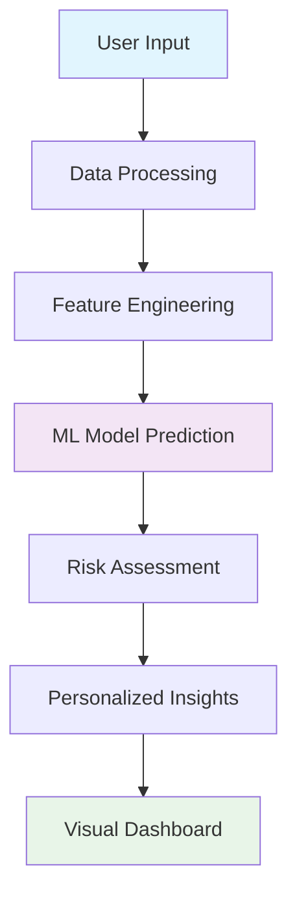

# 🩺 MediCheck - AI-Powered Health Risk Prediction & Awareness Tool

<div align="center">

[](https://medi-check.streamlit.app/)
[](https://www.python.org/downloads/)
[](https://scikit-learn.org/)
[](LICENSE)
[](https://github.com/yourusername/medicheck)

**🚀 [Live Demo](https://medi-check.streamlit.app/) | 📊 [Datasets Used](#datasets) | 🎯 [Features](#features) | 🔧 [Installation](#installation)**


*An intelligent health screening assistant that provides early health risk awareness through AI-powered symptom analysis*

</div>

---

## 🌟 Overview

**MediCheck** is an innovative AI-powered health risk prediction tool developed for **SERVE-A-THON 2025**. Our mission is to democratize healthcare access by providing intelligent symptom analysis and personalized health insights to everyone, anywhere.

> 🏆 **Team Chhichhore** | Rajalakshmi Institute of Technology

### 🎯 The Problem We Solve

- **Symptom Interpretation Complexity**: Many people struggle to understand what their symptoms might indicate
- **Lack of Personalized Insights**: Generic health advice doesn't account for individual factors like age, gender, and lifestyle
- **Healthcare Accessibility**: Limited access to immediate medical guidance, especially in underserved areas

### 💡 Our Solution

MediCheck bridges the gap between symptom awareness and professional medical care by providing:
- **Intelligent Symptom Analysis** using advanced ML algorithms
- **Personalized Risk Assessment** based on comprehensive health profiling  
- **Preventive Health Guidance** tailored to individual risk factors
- **Early Screening Assistant** to complement professional medical advice

---

## ✨ Features

### 🔍 **Smart Symptom Analysis**
- Multi-symptom selection interface with 100+ medical symptoms
- AI-powered pattern recognition for accurate predictions
- Real-time analysis with instant results

### 📊 **Comprehensive Risk Assessment**
- **Top 5 Disease Predictions** with confidence scores
- **Interactive Visualizations** including bar charts and radar plots
- **Detailed Risk Stratification** (High/Medium/Low risk categories)

### 💡 **Personalized Health Insights**
- Evidence-based **preventive recommendations**
- **Lifestyle modification suggestions**
- **Health awareness education** tailored to predicted conditions

### 📱 **Mobile-First Design**
- **Fully responsive** interface optimized for all devices
- **Touch-friendly** controls with intuitive navigation
- **Progressive Web App** capabilities for offline access

### 🎨 **Modern UI/UX**
- **Glassmorphism design** with smooth animations
- **Dark/Light theme** support
- **Accessibility-first** approach with proper contrast and typography

---

## 🏗️ Architecture & Workflow



### 🔄 **4-Step Process**

1. **📝 Data Collection**: Users input symptoms and basic health information
2. **🔧 Data Preprocessing**: Intelligent data cleaning and feature transformation
3. **🤖 AI Analysis**: Advanced ML models analyze patterns and predict health risks
4. **📊 Results Delivery**: Clear, actionable insights with visual representations

---

## 🛠️ Technology Stack

<div align="center">

### **Core Technologies**


### **Web Framework & UI**


### **Machine Learning Models**
- 🌲 **Random Forest Classifier** - Primary prediction engine
- 📈 **Linear Regression** - Risk score calibration
- 🔍 **Multi-Label Binarizer** - Symptom encoding
- ⚖️ **Label Encoder** - Disease classification

</div>

---

## 📊 Datasets

Our models are trained on comprehensive medical datasets:

| Dataset | Source | Records | Features |
|---------|--------|---------|----------|
| **Symptom-Disease** | Kaggle | 10,000+ | 132 symptoms → 42 diseases |
| **Heart Disease** | UCI ML Repository | 1,025 | 14 cardiac risk factors |
| **Diabetes** | UCI ML Repository | 768 | 8 metabolic indicators |
| **Liver Disease** | UCI ML Repository | 583 | 11 liver function markers |

---

## 🚀 Quick Start

### 🌐 **Try Online (Recommended)**
Visit our live application: **[https://medi-check.streamlit.app/](https://medi-check.streamlit.app/)**

### 💻 **Local Installation**

#### Prerequisites
```bash
Python 3.8+
pip package manager
```

#### Setup Instructions

1. **Clone the Repository**
```bash
git clone https://github.com/yourusername/medicheck.git
cd medicheck
```

2. **Create Virtual Environment**
```bash
python -m venv medicheck-env
source medicheck-env/bin/activate  # On Windows: medicheck-env\Scripts\activate
```

3. **Install Dependencies**
```bash
pip install -r requirements.txt
```

4. **Download Model Files**
```bash
# Place your trained model files in the model/ directory
mkdir model
# Add: disease_model.pkl, symptom_encoder.pkl, label_encoder.pkl
```

5. **Run the Application**
```bash
streamlit run app.py
```

6. **Open Browser**
Navigate to `http://localhost:8501`

---

## 📁 Project Structure

```
medicheck/
├── 📱 app.py                 # Main Streamlit application
├── 🤖 model/                 # Trained ML models
│   ├── disease_model.pkl     # Primary prediction model
│   ├── symptom_encoder.pkl   # Symptom preprocessing
│   └── label_encoder.pkl     # Disease label encoding
├── 📊 data/                  # Dataset files
│   └── Disease precaution.csv
├── 🎨 assets/                # UI assets and images
├── 📋 requirements.txt       # Python dependencies
├── 📖 README.md             # Project documentation
└── 📜 LICENSE               # MIT License
```

---

## 🎯 Unique Selling Points

### 🔬 **Comprehensive Prediction Engine**
- Analyzes 100+ symptoms across 42+ medical conditions
- Multi-model ensemble for higher accuracy
- Transparent AI with explainable predictions

### 🎨 **Superior User Experience**  
- Intuitive symptom selection interface
- Real-time analysis with beautiful visualizations
- Mobile-optimized responsive design

### 🌍 **Universal Accessibility**
- No registration required - instant access
- Works on any device with internet connection
- Designed for users of all technical backgrounds

### 🛡️ **Ethical AI Implementation**
- Clear medical disclaimers and limitations
- Promotes professional medical consultation
- Privacy-first design with no data storage

---

## 📈 Future Enhancements

### 🚀 **Planned Features**
- [ ] **IoT Integration**: Connect with wearable devices and health monitors
- [ ] **Multilingual Support**: Chatbot interface in multiple languages  
- [ ] **Personal Health Dashboard**: Track symptoms and predictions over time
- [ ] **Telemedicine Integration**: Direct connection to healthcare providers
- [ ] **Advanced Analytics**: Trend analysis and health pattern recognition

### 🌍 **Expected Impact**
- 📋 **Early Health Awareness**: Enable proactive health management
- 🏥 **Healthcare Load Reduction**: Decrease unnecessary emergency visits
- 🎯 **Informed Decision Making**: Empower users with health knowledge
- 🌐 **Rural Healthcare Support**: Bridge healthcare gaps in underserved areas

---

## 🤝 Contributing

We welcome contributions from the community! Here's how you can help:

### 🐛 **Bug Reports**
Found a bug? [Open an issue](https://github.com/AkasK09/Medi-check/blob/main/.github/ISSUE_TEMPLATE/bug_report.md)

### 💡 **Feature Requests** 
Have an idea? [Suggest a feature](https://github.com/AkasK09/Medi-check/blob/main/.github/ISSUE_TEMPLATE/feature_request.md)

### 🔧 **Development**
1. Fork the repository
2. Create a feature branch (`git checkout -b feature/amazing-feature`)
3. Commit your changes (`git commit -m 'Add amazing feature'`)
4. Push to the branch (`git push origin feature/amazing-feature`)
5. Open a Pull Request

---

## 👥 Team Chhichhore

<div align="center">

| Role | Name | GitHub | LinkedIn |
|------|------|--------|----------|
| **Team Lead** | Akash K | [@akashk](https://github.com/akashk) | [LinkedIn](https://linkedin.com/in/akashk) |
| **ML Engineer** | Ananda Krishna | [@anandakrishna](https://github.com/ananda-0007) | [LinkedIn](linkedin.com/in/ananda-krishna-9b70902ab) |
| **Full-Stack Dev** | Chidambaram D | [@chidambaram](https://github.com/Chidambaram4675) | [LinkedIn](linkedin.com/in/chidambaram-d-a8aa9332a) |
| **UI/UX Designer** | Aswin Ananth S | [@aswinananth](https://github.com/Aswinx05) | [LinkedIn](linkedin.com/in/aswin-ananth-s-83371a32b) |

**🎓 Rajalakshmi Institute of Technology**

</div>

---

## ⚠️ Important Medical Disclaimer

> **MediCheck is designed for informational and educational purposes only.**
> 
> - 🚫 **Not a substitute** for professional medical advice, diagnosis, or treatment
> - 👨‍⚕️ **Always consult** qualified healthcare providers for medical concerns  
> - 🔬 **AI predictions** are based on patterns in data and may not be 100% accurate
> - 🏥 **Seek immediate medical attention** for emergency situations

---

## 📜 License

This project is licensed under the **MIT License** - see the [LICENSE](LICENSE) file for details.

```
MIT License - Copyright (c) 2024 Team Chhichhore
Permission is hereby granted, free of charge, to use, copy, modify, merge, publish, 
distribute, sublicense, and/or sell copies of the Software.
```

---

## 🙏 Acknowledgments

- 🏆 **SERVE-A-THON 2025** for providing the platform to showcase our innovation
- 🎓 **Rajalakshmi Institute of Technology** for academic support and guidance  
- 📊 **Kaggle & UCI ML Repository** for providing high-quality medical datasets
- 🚀 **Streamlit Community** for the amazing framework and deployment platform
- 👨‍⚕️ **Healthcare Professionals** who inspired this project's ethical approach

---

<div align="center">

### 🌟 Star this repository if you found it helpful!


---

**Made with ❤️ by Team Chhichhore | SERVE-A-THON 2025**

*Empowering healthier lives through intelligent technology*

</div>
